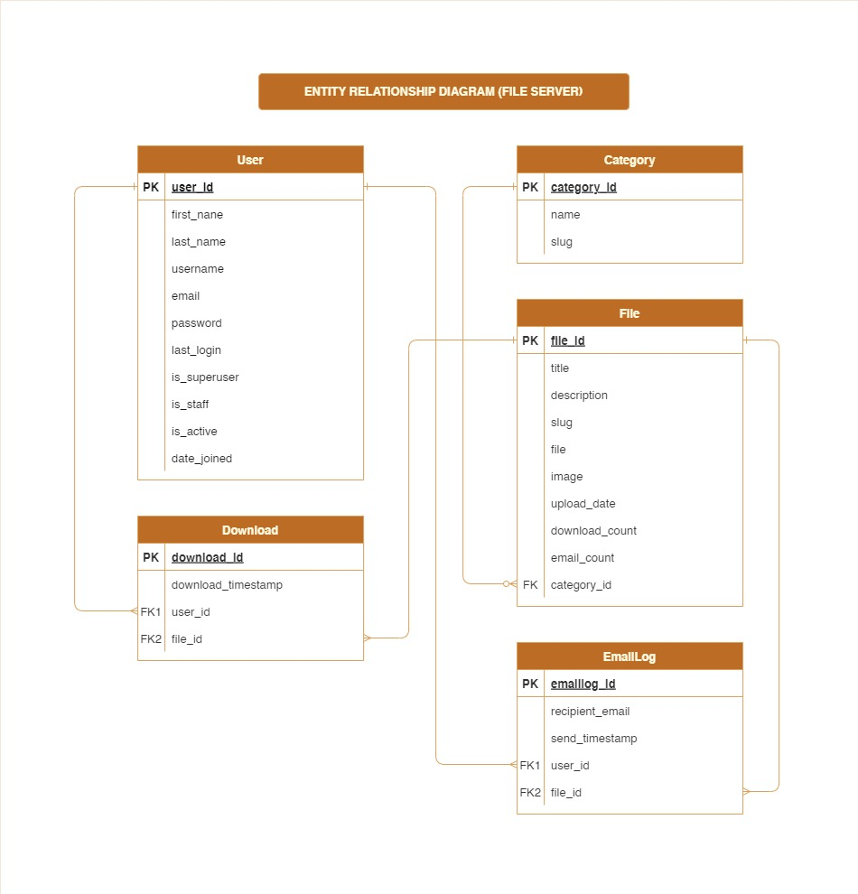
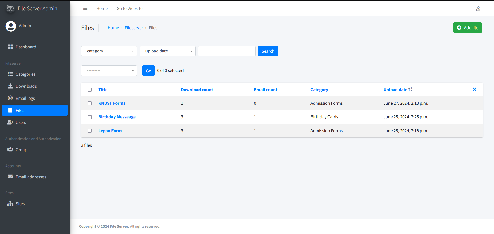

# File Server Project

## Table of Contents

1. [Project Overview](#project-overview)
2. [Features](#features)
3. [Tech Stack](#tech-stack)
4. [Getting Started](#getting-started)
   - [Prerequisites](#prerequisites)
   - [Installation](#installation)
   - [Running the Application](#running-the-application)
5. [Database Schema](#database-schema)
6. [API Endpoints](#api-endpoints)
7. [User Interface](#user-interface)
8. [Deployment](#deployment)
9. [Live Project Link](#live-project-link)

## Project Overview

Lizzy runs a business that distributes documents in the likes of wedding cards, admission forms etc. on behalf of various businesses to different users. All have been moving well, but she desires to scale her business.
After doing research, she finds that having a digital platform where these can be easily accessed and downloaded remotely is a good solution to the scaling challenge she currently faces. She has found you after
your relatives in her network defended you to be the right person for the job.

This project aims to develop a digital platform for users to access and download these documents remotely.

## Features

### User Features

1. **Signup & Login**: Users can sign up and log in using email and password. Account verification and password reset features are included.
2. **Feed Page**: Displays a list of downloadable files.
3. **Search**: Users can search for specific files.
4. **Send File via Email**: Users can send files to an email address through the platform.

### Admin Features

1. **Upload Files**: Admin can upload files with a title, description, image and category.
2. **Analytics**: Admin can view the number of downloads and emails sent for each file.

## Tech Stack

- **Backend**: Django, Django Rest Framework
- **Frontend**: HTML, CSS, JavaScript, Bootstrap
- **Database**: PostgreSQL (recommended for production), SQLite (for development)
- **Version Control**: Git, GitHub
- **Deployment**: Heroku/AWS/DigitalOcean
- **Email Service**: Django’s email backend, SMTP server (e.g., Gmail SMTP, SendGrid)

## Getting Started

### Prerequisites

- Python 3.x
- Django 3.x or higher
- PostgreSQL (or SQLite for development)
- Git

### Installation

1. **Clone the repository**:
   ```bash
   git clone https://github.com/Solomon-K-Acquah/File-Server.git
   cd File-Server
   ```
2. **Create and activate a virtual environment**:
   ```bash
   - For Windows
   python -m venv env
   env/Scripts/activate
   ```
   ```bash
   - For Mac
   python3 -m venv env
   source env/bin/activate
   ```
3. **Install dependencies**:

   ```bash
   pip install -r requirements.txt
   ```

4. **Set up the database**:

   - **For PostgreSQL**:
     Update the `DATABASES` setting in `settings.py` with your PostgreSQL credentials.
   - **For SQLite** (default):
     No changes needed.

5. **Apply database migrations**:
   ```bash
   python manage.py migrate
   ```
6. **Create a superuser**:
   ```bash
   python manage.py createsuperuser
   ```

### Running the Application

1. **Start the development server**:
   ```bash
   python manage.py runserver
   ```
2. **Access the application**:
   - User interface: `http://127.0.0.1:8000/`
   - Admin interface: `http://127.0.0.1:8000/admin`

## Database Schema

### File Server ER Diagram



## API Endpoints

### User Authentication

- `POST /api/register/`: Register a new user.
- `POST /api/login/`: Log in a user.
- `POST /api/logout/`: Log out the current user.
- `POST /api/password_reset/`: Request a password reset.
- `POST /api/password_reset_confirm/`: Confirm password reset.

### File Management

- `GET /api/files/`: List all files.
- `GET /api/files/<slug>/`: Retrieve a specific file.
- `POST /api/files/`: Upload a new file (Admin only).
- `POST /api/files/<slug>/send_email/`: Send file to an email address.
- `GET /api/files/<slug>/download/`: Download a specific file.

## User Interface

### Frontend UI


### Backend UI



## Deployment

1. **Choose a hosting platform**: (e.g., Heroku, AWS, DigitalOcean).
2. **Configure settings for production**:
   - Set `DEBUG=False` in `settings.py`.
   - Set up allowed hosts.
   - Configure a production database.
   - Set up email backend for account verification and password resets.
3. **Deploy the application**:
   Follow the deployment guides for your chosen platform to deploy the Django application.

## Live Project Link

[Link to the deployed project](http://104.248.233.142/)

[Admin panel](http://104.248.233.142/admin)

### Admin Login Credentials

**Email**: admin@gmail.com.
**Password**: admin.
